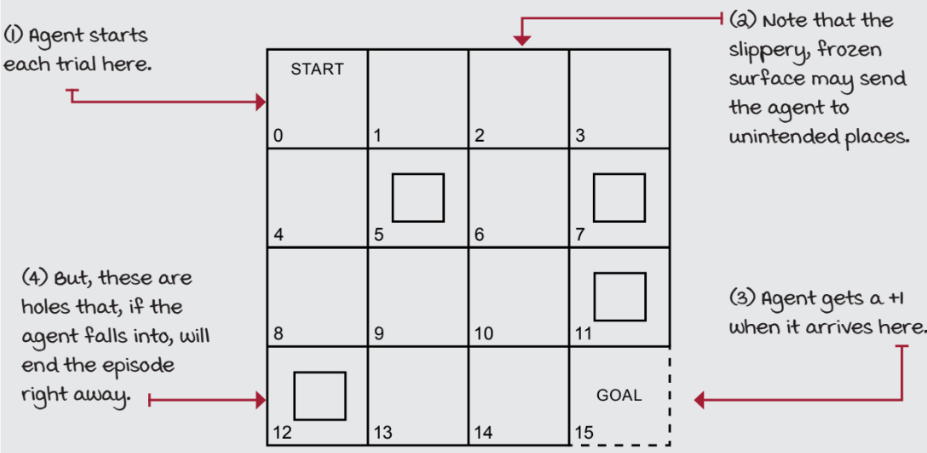
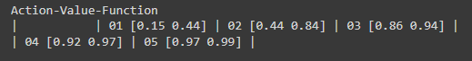
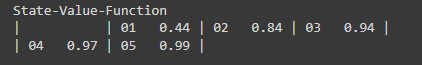
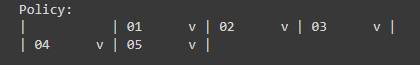
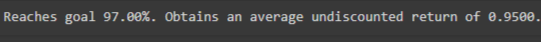

# MONTE CARLO CONTROL ALGORITHM

## AIM:
To develop a Python program to find the optimal policy for the given RL environment using the Monte Carlo algorithm.

## PROBLEM STATEMENT:
The FrozenLake environment in OpenAI Gym is a grid world problem that challenges reinforcement learning agents to navigate a slippery terrain to reach a goal state while avoiding hazards. Note that the environment is closed with a fence, so the agent cannot leave the grid world.

### STATES:
* 5 Terminal States:
  * G (Goal): The state the agent
    aims to reach.
  * H (Hole): A hazardous state  
    that the agent must avoid at all costs.
* 11 Non-terminal States:
  * S (Starting state): The initial   
    position of the agent.
  * Intermediate states: Grid cells 
    forming a layout that the agent must traverse.

### ACTIONS:
The agent has 4 possible actions:

* 0: Left
* 1: Down
* 2: Right
* 3: Up

### TRANSITION PROBABILITIES:
Slippery surface with a 33.3% chance of moving as intended and a 66.6% chance of moving in orthogonal directions. For example, if the agent intends to move left, there is a

* 33.3% chance of moving left, a
* 33.3% chance of moving down, and a
* 33.3% chance of moving up.

### REWARD:
The agent receives a reward of 1 for reaching the goal state, and a reward of 0 otherwise.

### GRAPHICAL REPRESENTATION:


## MONTE CARLO CONTROL ALGORITHM:
1. Initialize the state value function V(s) and the policy π(s) arbitrarily.

2. Generate an episode using π(s) and store the state, action, and reward sequence.

3. For each state s appearing in the episode:
  * G ← return following the first occurrence of s
  * Append G to Returns(s)
  * V(s) ← average(Returns(s))

4. For each state s in the episode:
  * π(s) ← argmax_a ∑_s' P(s'|s,a)V(s')

5. Repeat steps 2-4 until the policy converges.

6. Use the function decay_schedule to decay the value of epsilon and alpha.

7. Use the function gen_traj to generate a trajectory.

8. Use the function tqdm to display the progress bar.

9. After the policy converges, use the function np.argmax to find the optimal policy. The function takes the following arguments:
  * Q: The Q-table.
  * axis: The axis along which to find the maximum value.

## MONTE CARLO CONTROL FUNCTION:
```
Developed by:Paarkavy B
Reg No:212221230072
```

```
from numpy.lib.function_base import select
from collections import defaultdict
def mc_control(env, gamma=1.0, init_alpha=0.5, min_alpha=0.01, alpha_decay_ratio=0.5,
               init_epsilon=1.0, min_epsilon=0.1, epsilon_decay_ratio=0.9,
               n_episodes=3000, max_steps=200, first_visit=True):

    nS, nA = env.observation_space.n, env.action_space.n
    Q = defaultdict(lambda: np.zeros(nA))
    V = defaultdict(float)
    pi = defaultdict(lambda: np.random.choice(nA))
    Q_track = []
    pi_track = []
    select_action = lambda state , Q, epsilon:\
    np.argmax(Q[state])\
    if np.random.random() > epsilon\
    else np.random.randint(len(Q[state]))
    for episode in range(n_episodes):
        epsilon = max(init_epsilon * (epsilon_decay_ratio ** episode), min_epsilon)
        alpha = max(init_alpha * (alpha_decay_ratio ** episode), min_alpha)
        trajectory = generate_trajectory(select_action, Q, epsilon, env, max_steps)
        n = len(trajectory)
        G = 0
        for t in range(n - 1, -1, -1):
            state, action, reward, _, _ = trajectory[t]
            G = gamma * G + reward
            if first_visit and (state, action) not in [(s, a) for s, a, _, _, _ in trajectory[:t]]:
                Q[state][action] += alpha * (G - Q[state][action])
                V[state] = np.max(Q[state])
                pi[state] = np.argmax(Q[state])
        Q_track.append(Q.copy())
        pi_track.append(pi.copy)
    return Q, V, pi
```

## OUTPUT:





## RESULT:
Thus a Python program is developed to find the optimal policy for the given RL environment using the Monte Carlo algorithm.
